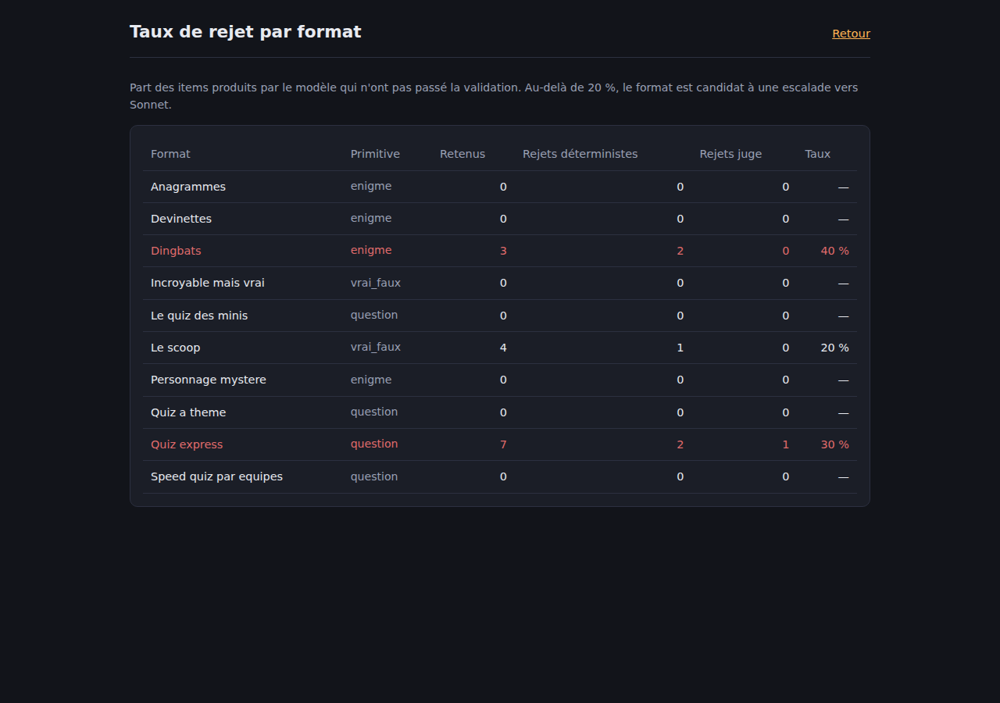
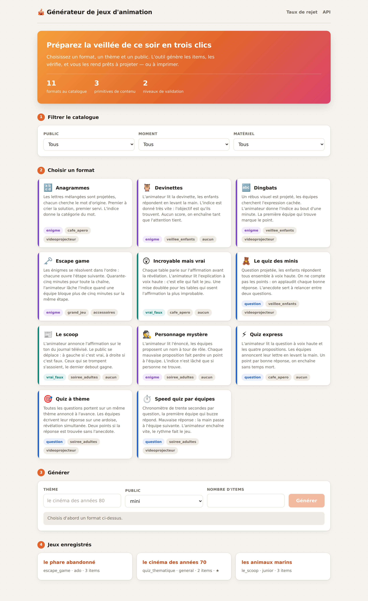
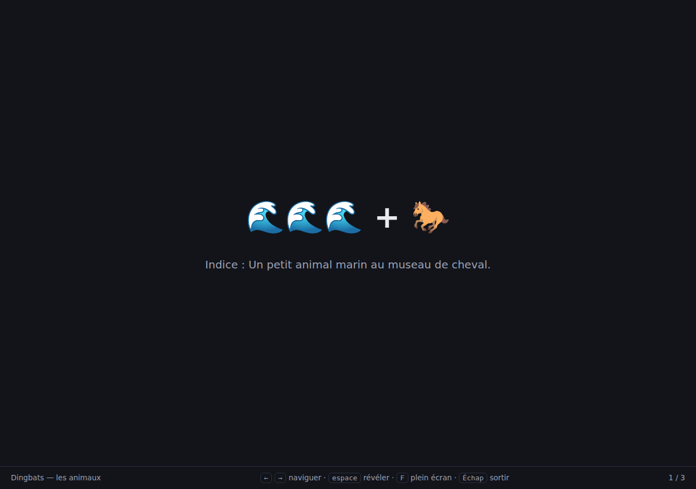
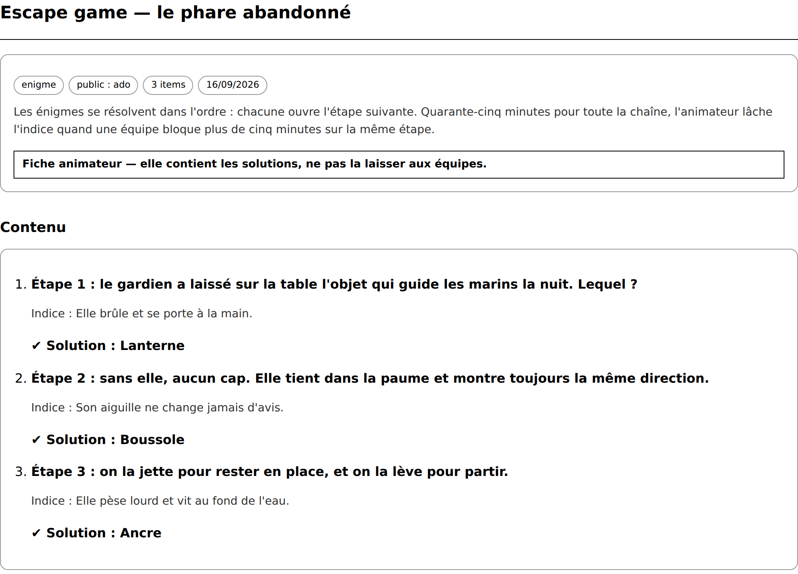

# Générateur de jeux d'animation

Outil de préparation de jeux pour animateurs : on choisit un format, un thème et un
public, l'outil génère le contenu, **le valide**, l'enregistre et l'affiche en mode
projection.


---

## Le problème

J'ai été animateur socioculturel pendant trois ans — clubs de vacances, périscolaire,
EHPAD. Préparer les jeux prend des heures de soirée, et c'est du travail répétitif qui
recommence intégralement à chaque nouveau groupe.

Un modèle de langage sait écrire un quiz en quelques secondes. Le problème, c'est qu'il
l'écrit avec un aplomb total, et que la bonne réponse est parfois fausse, absente des
propositions, ou présente deux fois. Une énigme générée est souvent insoluble, ou
contient sa propre solution. Or l'animateur est devant cinquante personnes quand il
découvre le problème.

**Ce projet n'est donc pas un projet de génération. C'est un projet de validation.**

---

## L'idée d'architecture

Je ne code pas vingt jeux. **Je code trois primitives de génération.**

Le mécanisme d'un jeu — comment on y joue — n'a pas besoin d'être généré : il est fixe et
l'animateur le connaît. Ce qui lui manque, c'est le *contenu*. Or vingt jeux différents ne
produisent que quelques formes de contenu.

| Primitive | Ce que le modèle produit | Formats couverts |
|---|---|---|
| `question` | question + 4 propositions + bonne réponse + anecdote | quiz express, quiz des minis, quiz à thème, speed quiz |
| `enigme` | énoncé + solution + indice | dingbats, personnage mystère, devinettes, anagrammes, escape game |
| `vrai_faux` | affirmation + verdict + explication | le scoop, incroyable mais vrai |

**Conséquence : ajouter un format, c'est une ligne en base et un gabarit de prompt, zéro
ligne de Python.** Ajouter une primitive, ça c'est du code. Cette séparation entre ce qui
se configure et ce qui se développe est le point d'architecture central du projet.

Le catalogue de départ contient dix formats pour trois primitives : c'est la démonstration.

Le onzième la met à l'épreuve. `escape_game` est arrivé après coup, une fois le projet
en place. Une chaîne d'énigmes reliées par un scénario, ça ressemble à un format à part ;
ce n'en est pas un. C'est la primitive `enigme`, plus un paragraphe de gabarit qui demande
une progression ordonnée. Il se filtre, se génère, se valide et s'enregistre comme les
autres — sans une ligne de Python, et un test vérifie qu'il en reste là.

---

## La validation, en deux niveaux

**Rien n'entre en base sans avoir passé les deux.**

### Niveau 1 — déterministe, en code

Gratuit, instantané, certain. Il s'exécute **en premier** : ce qui est rejeté ici ne coûte
aucun appel de modèle. C'est le principal levier de coût du projet.

| Primitive | Règles |
|---|---|
| commun | schéma Pydantic respecté, aucun champ vide, aucun champ en trop, longueurs maximales |
| `question` | exactement 4 propositions, aucun doublon après normalisation, la bonne réponse figure une fois et une seule |
| `enigme` | la solution n'apparaît ni dans l'énoncé ni dans l'indice, variantes comprises ; solution de deux mots maximum |
| `vrai_faux` | verdict dans `{vrai, faux}`, le mot ne figure pas dans l'affirmation, et 30 à 70 % de vraies sur le lot |

Tout repose sur deux fonctions partagées, dans `app/normalisation.py` :

- `normaliser(texte)` — minuscules, accents et ponctuation retirés, espaces réduits ;
- `contient(texte, terme)` — comparaison **mot à mot** et non par sous-chaîne, sinon la
  solution « or » serait détectée dans le mot « corps » et toutes les énigmes seraient
  rejetées à tort.

Ce sont les premières fonctions couvertes par les tests.

### Niveau 2 — le juge

Un second appel de modèle, qui ne tranche **que ce que le code ne peut pas trancher** :
exactitude factuelle et adéquation au public. Verdict binaire par item, plus un motif.

Un juge injoignable ou illisible rejette tout le lot : du contenu non contrôlé ne doit
jamais passer par défaut.

### Et si ça échoue

On régénère — en ne redemandant que les items manquants — **trois tentatives maximum**,
puis erreur explicite. Chaque rejet est enregistré avec son motif et son niveau.

**Le taux de rejet par format est affiché dans l'interface** : c'est la preuve que la
validation sert à quelque chose. Au-delà de 20 % sur un format, il passe en Sonnet et la
raison est notée dans le `JOURNAL.md`.



> Principe général du projet : *un modèle à qui on ne donne rien à mesurer invente.*

---

## Ce que donne le même produit sans validation

J'ai fait générer une autre version de ce produit, en JavaScript, à partir d'une simple
description. Elle est plus jolie que celle-ci et couvre plus de formats. Elle m'a surtout
servi de contre-exemple, et c'est à ce titre qu'elle a sa place ici.

Elle embarque une bibliothèque de validation de schéma dans ses dépendances, et ne
l'importe **nulle part**. La réponse du modèle est désérialisée puis affichée telle
quelle : pas de schéma, pas de vérification, pas de juge, pas de comptage. Une bonne
réponse absente de ses propres propositions arrive au vidéoprojecteur sans que rien ne
l'arrête.

Plus gênant : quand l'appel échoue — clé absente, JSON tronqué, flux coupé — elle renvoie
un contenu écrit en dur, annoncé comme terminé, avec le thème demandé dans le titre.
L'animateur ne peut pas distinguer ce qui a été généré de ce qui était déjà là.

D'où les deux choix opposés de ce projet : **rien n'entre en base sans avoir passé les
deux niveaux**, et quand les trois tentatives échouent, l'outil affiche l'erreur et les
motifs. Une erreur explicite est plus utile qu'un contenu plausible — surtout quand on la
découvre devant cinquante personnes.

---

## Stack

Python · FastAPI · Pydantic · SQLAlchemy · PostgreSQL · Alembic · Jinja2 et JavaScript
natif · pytest · GitHub Actions.

**Haiku 4.5 pour la génération et pour le juge.** C'est le moins cher de la gamme, et sur
une sortie JSON fortement contrainte il suffit. Ordre de grandeur : un demi-centime par
jeu généré.

Autres leviers de coût : le déterministe avant le juge ; même format + même thème + même
public déjà en base, on ressert au lieu de régénérer ; plafond de dépense côté console.

Pas de front Next.js : l'objet de la démonstration ici est le back-end Python.

---

## Lancer le projet

### Le plus simple : Docker

Une base Postgres et l'application, câblées ensemble. Rien à installer d'autre que
[Docker Desktop](https://www.docker.com/products/docker-desktop/) — ni Python, ni
PostgreSQL.

```bash
git clone https://github.com/arthurparoisgithu/animation.git
cd animation
cp .env.example .env     # puis y coller la clé d'API
docker compose up
```

L'application répond sur <http://localhost:8000>. Les tables sont créées et le catalogue
inséré à chaque démarrage : le seed est idempotent, le rejouer est sans risque. Les jeux
générés survivent aux redémarrages — ils sont dans un volume Docker, et ils ont été payés.

**Sous Windows**, trois fichiers évitent la ligne de commande :

| Fichier | Ce qu'il fait |
|---|---|
| `demarrer.bat` | Vérifie Docker, crée le `.env` et l'ouvre s'il manque la clé, démarre, ouvre le navigateur. |
| `arreter.bat` | Arrête tout, en conservant les jeux déjà générés. |
| `journal.bat` | Affiche les messages de l'application, à copier en cas de problème. |

### À la main, sans Docker

```bash
git clone https://github.com/arthurparoisgithu/animation.git
cd animation

python3 -m venv .venv
source .venv/bin/activate          # Windows : .venv\Scripts\activate
pip install -r requirements.txt

cp .env.example .env               # puis renseigner ANTHROPIC_API_KEY
```

Une base Postgres est nécessaire :

```bash
createdb animation
alembic upgrade head               # crée les trois tables
python -m scripts.seed             # insère les onze formats du catalogue
```

Puis :

```bash
uvicorn app.main:app --reload
```

- interface : <http://127.0.0.1:8000/>
- documentation OpenAPI, générée par FastAPI : <http://127.0.0.1:8000/docs>

### Générer sans passer par l'interface

```bash
python -m scripts.generer --format quiz_express --theme "le cinéma des années 90" --public ado
python -m scripts.generer --format dingbats --theme "les animaux" --public junior --sans-juge
```

`--sans-juge` évite l'appel au juge pendant la mise au point d'un gabarit : on ne paie
alors que la génération.

### Enregistrer une fois, rejouer toujours

Un appel de modèle coûte de l'argent et n'est jamais deux fois identique. Le projet
isole donc **une seule couture** — `app/transport.py` — et la branche de trois façons :

| Mode | Ce qui se passe | Coût |
|---|---|---|
| `api` | appel réel | ~1 centime par jeu |
| `enregistrement` | appel réel, puis la réponse brute est écrite dans `fixtures/` | idem, une fois |
| `rejeu` | la réponse enregistrée est relue, aucun réseau | zéro |

```bash
# Une seule fois, avec une clé d'API : c'est la seule commande qui coûte.
# --sans-base évite d'avoir à installer PostgreSQL juste pour ça.
python -m scripts.campagne --enregistrer --sans-base

# Ensuite, autant de fois qu'on veut, gratuitement.
python -m scripts.campagne --rejouer
```

Le générateur et le juge ne savent pas d'où vient la réponse — ils appellent
`modele.appeler()`, qui délègue au transport actif. Rien d'autre ne change.

Trois bénéfices, et le troisième est le plus important :

- **le coût** : une campagne payante, rejouée ensuite par les tests, par la démo et par
  quiconque clone le dépôt ;
- **le déterminisme** : mêmes entrées, mêmes sorties, donc un test qui passe aujourd'hui
  passera demain ;
- **la preuve** : ce sont de *vraies* sorties de modèle, défauts compris. Une fixture que
  la validation rejette vaut mieux qu'un cas inventé — elle montre que le problème est
  réel.

Un prompt absent des fixtures lève une erreur explicite plutôt que de repartir vers un
appel facturé : une démo en ligne ne doit pas se mettre à dépenser sans prévenir. Côté
API, ce cas renvoie un 503 avec un message lisible, pas un 500.

### Les tests

```bash
pytest
```

Les tests de validation et de génération ne touchent ni au réseau ni à la base : l'appel
au modèle est simulé, ils sont déterministes et gratuits. Ceux de l'API ont besoin d'un
Postgres joignable via `DATABASE_URL` ; sans lui ils sont ignorés, pas mis en échec.

GitHub Actions les lance à chaque push, avec un service Postgres. Aucun secret n'est
nécessaire : aucune clé d'API ne circule dans la CI.

---

## Mise en ligne

La démo publique tourne en `MODE_MODELE=rejeu` : elle rejoue les générations
enregistrées dans `fixtures/`. Un visiteur voit donc toute l'application et de vraies
sorties de modèle, **sans qu'un seul appel soit facturé**.

Le déploiement est décrit par deux fichiers versionnés : `Dockerfile` et `fly.toml`.

```bash
fly launch --no-deploy      # crée l'application, garde le fly.toml du dépôt
fly deploy
```

`fly.toml` déclare une `release_command` qui, avant chaque mise en ligne, applique les
migrations, insère le catalogue, puis **rejoue les fixtures pour remplir la démo**. Sans
cette troisième étape, un visiteur arriverait sur une application vide. Les trois sont
idempotentes : le seed met à jour les gabarits, et un jeu déjà en base est resservi plutôt
que dupliqué. Tant qu'aucune fixture n'a été enregistrée, le rejeu sort proprement au lieu
de faire échouer le déploiement.

**La génération payante est fermée par défaut.** En `MODE_MODELE=api`, un
`CODE_GENERATION` est *obligatoire* : sans lui l'API répond 403 et explique quoi faire.
Le défaut dangereux est celui qui coûte de l'argent — il doit être impossible à atteindre
par oubli. En mode `rejeu` aucun appel n'est émis, donc aucun code n'est exigé et la démo
fonctionne pour tout le monde. Le code est comparé avec `secrets.compare_digest`, dont le
temps d'exécution ne dépend pas du nombre de caractères corrects.

Deux autres détails qui comptent :

- **Les hébergeurs fournissent `DATABASE_URL` sous la forme `postgres://…`.** SQLAlchemy 2
  exige un pilote explicite et refuse cette forme, donc la configuration la réécrit en
  `postgresql+psycopg://` plutôt que d'exiger une variable différente de celle que
  l'hébergeur crée tout seul.
- **Un `%` dans le mot de passe généré faisait échouer la migration**, avant même la
  connexion : Alembic passait l'URL par `configparser`, qui y voyait une interpolation.
  Le moteur est maintenant construit directement. La CI utilise délibérément un mot de
  passe contenant un `%` pour que ce cas reste couvert.

La machine dort quand personne ne consulte la démo (`auto_stop_machines`), et redémarre
à la première requête.

---

## L'interface

Le catalogue se filtre par public, moment de la journée et matériel disponible — ce sont
les trois contraintes réelles d'un animateur qui prépare une soirée.



Le mode projection est fait pour un vidéoprojecteur : fond sombre, texte dimensionné en
unités relatives à la largeur d'écran, flèches pour naviguer, espace pour révéler la
réponse, `F` pour le plein écran.



Chaque jeu a aussi sa version papier. L'animateur n'est pas toujours derrière un écran :
une feuille dans la poche, c'est ce qui reste quand le vidéoprojecteur ne démarre pas. La
fiche porte la règle du format, les items et les solutions, et le rappel qu'elle ne se
pose pas sur la table des joueurs. Une feuille de style d'impression, pas une dépendance
de plus.



---

## Structure

```
app/
  normalisation.py   normaliser(), cle(), contient() — la base de toute comparaison
  schemas.py         les trois primitives en Pydantic, et les énumérations du catalogue
  validation.py      niveau 1 : les règles déterministes, fonctions pures
  gabarits.py        un gabarit de prompt par primitive
  catalogue.py       les onze formats du catalogue, source de vérité du seed
  transport.py       la couture : appel réel, enregistré, ou rejoué depuis fixtures/
  modele.py          appel Anthropic et extraction du JSON — tout le réseau est ici
  juge.py            niveau 2 : exactitude factuelle et adéquation au public
  generateur.py      orchestration : générer, valider, juger, recommencer
  modeles.py         les trois tables SQLAlchemy
  requetes.py        les requêtes SQL, dont le filtrage par tableau avec @>
  service.py         le lien entre le générateur et la base
  api.py             les routes JSON et les pages
scripts/
  generer.py         génération à la main, sans base ni API
  campagne.py        un jeu par format : enregistre les fixtures, ou les rejoue
  seed.py            insertion idempotente du catalogue
fixtures/            réponses de modèle enregistrées (voir fixtures/README.md)
docker-compose.yml   la base et l'application, câblées ensemble
demarrer.bat         démarrage en double-clic sous Windows (+ arreter, journal)
tests/               150 tests, dont 19 contre un vrai Postgres
alembic/             migrations
```

---

## Choix que je peux défendre

- **Le tableau Postgres pour `publics`** plutôt qu'une table de liaison. Ça permet
  d'écrire le filtrage avec l'opérateur de contenance `@>` et un index GIN, en une clause
  au lieu d'une jointure.
- **`contient()` compare mot à mot.** Une comparaison par sous-chaîne rejetterait une
  énigme correcte dès que la solution est un mot court.
- **`cle()` retire les déterminants de tête.** Sans elle, « L'Everest » et « Everest »
  sont deux réponses différentes, et le générateur repart pour un tour alors que l'item
  était bon. Une régénération inutile, c'est un appel payé pour rien.
- **La substitution des placeholders passe par une expression régulière**, pas par
  `str.format()` : les gabarits contiennent des accolades JSON d'exemple, sur lesquelles
  `format()` échoue.
- **Un échec de génération renvoie 422, pas 500.** Ce n'est pas un bug, c'est la
  validation qui refuse de livrer du contenu non vérifié.
- **La répartition vrai/faux est vérifiée sur le jeu final assemblé**, pas passe par
  passe : c'est le lot complet que l'animateur projette.
- **Un item qui viole trois règles compte pour un rejet**, avec ses trois motifs. Le taux
  de rejet se mesure en items, pas en motifs.
- **Une seule couture pour l'appel de modèle**, et trois implémentations derrière. C'est
  ce qui rend le projet démontrable sans clé et testable sans réseau, sans une seule
  ligne de code conditionnel dans le générateur ou le juge.
- **La protection de la génération est fermée par défaut.** Une règle qui ne s'applique
  que si on a pensé à la configurer ne protège rien : c'est l'absence de configuration
  qui doit bloquer, pas l'inverse.
- **Le complément de gabarit propre à un format est une entrée de dictionnaire**, pas une
  branche `if`. Une branche par format, c'est le glissement qui finit par ramener la
  logique de chaque jeu dans le code — exactement ce que l'architecture cherche à éviter.
- **Un test relit le catalogue directement dans `CLAUDE.md`** et le compare au code. La
  spécification et l'implémentation ne peuvent plus diverger en silence — ce test a déjà
  rattrapé trois noms de formats qui avaient perdu leurs accents.

---

## Limites assumées

- Deux primitives sont gardées pour plus tard : `consigne` (mimes, défis, gages) et
  `contrainte` (mots imposés). Leur contenu ne peut pas être validé automatiquement, or la
  validation est le cœur du projet. On commence par ce qu'on peut prouver.
- **Aucune parole de chanson** n'est générée ni stockée : ce sont des œuvres protégées.
- **Aucun nom de format télévisé** : les noms du catalogue sont les miens.
- **L'audio et l'image ne se génèrent pas ici.** Une playlist de blind test, si : titre,
  artiste, année, réponse attendue. L'outil produit la liste, pas le média.
- Si le projet est mis en ligne, la démo publique tourne en `MODE_MODELE=rejeu` et la
  génération réelle est protégée par un code (`CODE_GENERATION`). Un visiteur voit donc
  de vraies sorties de modèle et toute l'application, sans qu'un seul appel soit facturé.
- **`PATCH /api/jeux/{id}/favori` n'est pas authentifié** : sur la démo publique,
  n'importe qui peut basculer une étoile. C'est assumé — l'effet est nul et ajouter une
  authentification pour ça reviendrait à construire un système de comptes que le produit
  n'a pas. Un vrai déploiement multi-utilisateurs demanderait cette authentification, et
  c'est à ce moment-là qu'il faudra la faire.

---

Arthur Parois — [`JOURNAL.md`](JOURNAL.md) retrace le déroulé du développement.
